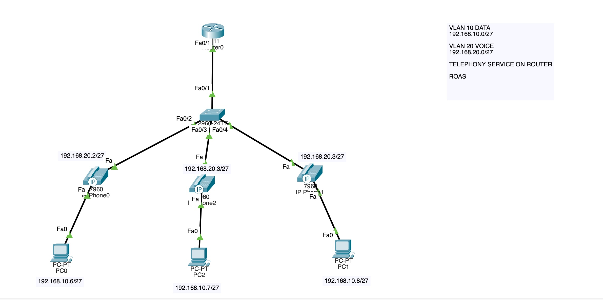
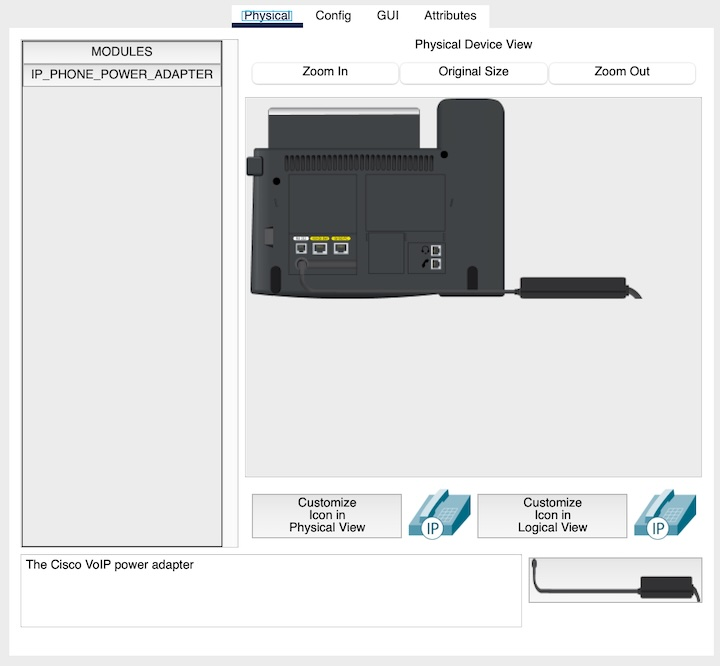

# Voice IP (VoIP) Configuration Lab Documentation

## Network Overview
In this lab, I simulated a simple topology for voice traffic using Cisco IP Phones. The setup includes a **2811 router** and a **2960 switch** designed for a VoIP lab with 3 Cisco IP Phones (model 7960) and 3 PCs, featuring **DHCP services**, **VLAN segmentation**, and a **Router on a Stick (ROAS)** configuration for inter-VLAN routing. The router handles both data and voice traffic, while the switch ensures proper VLAN management.



**IP-PHONES**: Click on each IP phone and plug in the power switch to turn it on.



---

## Router Configuration (`Router0`)

### 1. DHCP Configuration
DHCP is used to automatically assign IP addresses to devices on the network. The following configurations set up DHCP pools:

- **Exclude addresses** from DHCP to prevent IP conflicts:
  ```bash
  ip dhcp excluded-address 192.168.10.1 192.168.10.5
  ip dhcp excluded-address 192.168.20.1 192.168.20.5
  ```

- **DHCP Pools** for Data and Voice VLANs:
  - For **VLAN 10 (Data)**:
    ```bash
    ip dhcp pool DATA10
     network 192.168.10.0 255.255.255.224
     default-router 192.168.10.1
    ```
    This assigns IPs in the **192.168.10.0/27** subnet with **192.168.10.1** as the gateway.

  - For **VLAN 20 (Voice)**:
    ```bash
    ip dhcp pool VOICE20
     network 192.168.20.0 255.255.255.224
     default-router 192.168.20.1
     option 150 ip 192.168.20.1
    ```
    This assigns IPs in the **192.168.20.0/27** subnet and sets the TFTP server for voice devices.

---

### 2. VLAN and Router on a Stick (ROAS) Configuration
ROAS enables inter-VLAN routing through subinterfaces:

- **Create Subinterfaces** for each VLAN:
  - **FastEthernet0/1.10** (VLAN 10 - Data):
    ```bash
    interface FastEthernet0/1.10
     encapsulation dot1Q 10
     ip address 192.168.10.1 255.255.255.224
    ```
  
  - **FastEthernet0/1.20** (VLAN 20 - Voice):
    ```bash
    interface FastEthernet0/1.20
     encapsulation dot1Q 20
     ip address 192.168.20.1 255.255.255.224
    ```

---

### 3. Telephony-Service Configuration
This enables the router to support VoIP:

- **Enable telephony-service**:
  ```bash
  telephony-service
   max-ephones 3
   max-dn 3
   ip source-address 192.168.20.1 port 2000
   auto assign 1 to 3
  ```
  This configures ePhones and assigns directory numbers (DNs) automatically.

- **Configure Directory Numbers (DNs)**:
  - DN 1 (Extension 1010):
    ```bash
    ephone-dn 1
     number 1010
    ```
  - DN 2 (Extension 2020):
    ```bash
    ephone-dn 2
     number 2020
    ```
  - DN 3 (Extension 3030):
    ```bash
    ephone-dn 3
     number 3030
    ```

---

## Switch Configuration (`Switch`)

### 1. VLAN and Trunk Configuration
The switch handles VLANs for both data and voice:

- **Configure Trunking** on **FastEthernet0/1** for VLAN 10 and 20:
  ```bash
  interface FastEthernet0/1
   switchport trunk allowed vlan 10,20
   switchport mode trunk
  ```

- **Configure Access Ports** for data and voice VLANs:
  - On **FastEthernet0/2**:
    ```bash
    interface FastEthernet0/2
     switchport access vlan 10
     switchport mode access
     switchport voice vlan 20
    ```
  The same applies for **FastEthernet0/3** and **FastEthernet0/4**.

---

## Summary of Key Configurations
- **DHCP Pools** for Data (VLAN 10) and Voice (VLAN 20).
- **ROAS** with subinterfaces for inter-VLAN routing.
- **VoIP Configuration** with 3 extensions and auto-assigned ePhones.
- **Switch Setup** for trunking and access ports for both VLANs.

##### See the PacketTracer config file for details. Thanks 